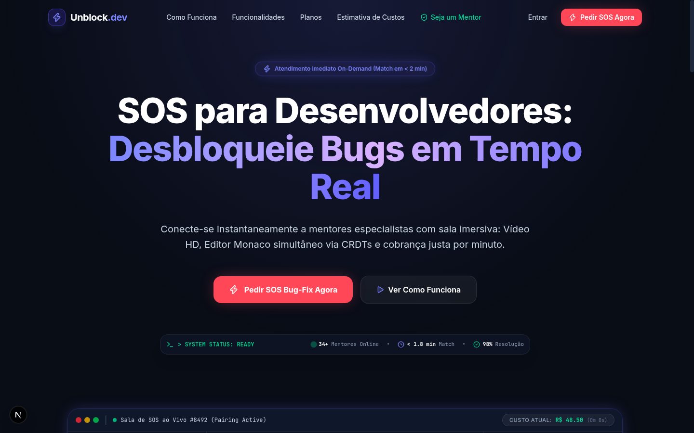
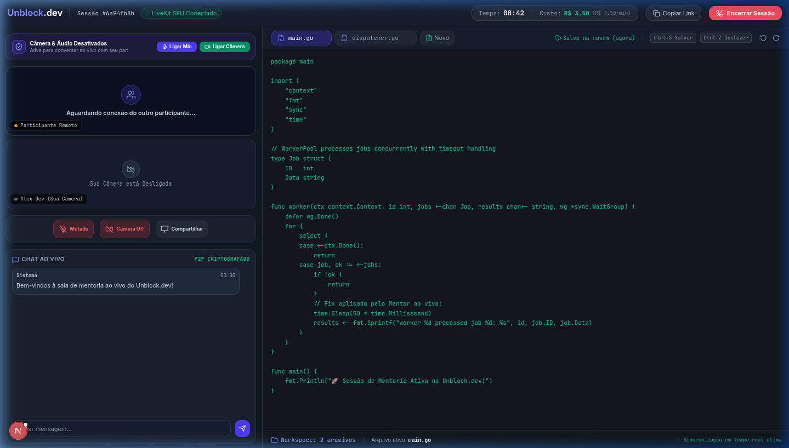
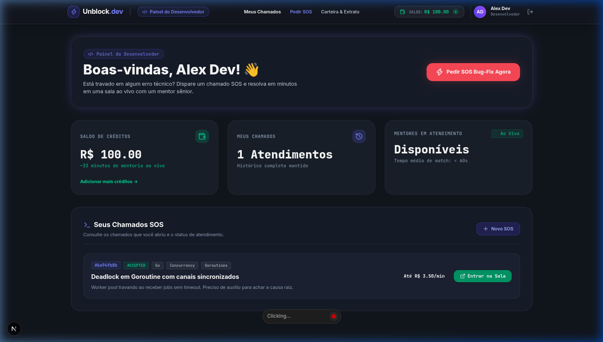

# 🚀 Unblock.dev — On-Demand Pair Programming & SOS Bug-Fixing Platform

[](https://go.dev/)
[](https://nextjs.org/)
[](https://react.dev/)
[](https://www.mongodb.com/)
[](https://redis.io/)
[](https://livekit.io/)
[](LICENSE)

**Unblock.dev** is a real-time pair programming platform operating on an **"SOS for Developers"** on-demand model. It instantly connects software engineers blocked by complex production bugs, concurrency issues, or architectural hurdles with senior specialists in interactive live rooms. 

The platform features ultra-low latency WebRTC video & audio, a collaborative multi-file Monaco Editor powered by CRDTs (conflict-free replicated data types), real-time P2P encrypted chat, and transparent pay-per-minute billing backed by ACID financial transactions.

---

## 📸 System Showcase & Visuals

### 1. Interactive Landing Page & Live Radar


---

### 2. Real-Time Pair Programming Room (`/room/[id]`)
> Complete collaborative workspace featuring WebRTC SFU media controls (privacy-first default), live cost ticker, multi-file code editor with cloud auto-save, and P2P chat.


---

### 3. Developer & Mentor Dashboard
> Manage credit balances, track open SOS tickets, monitor mentor availability, and jump straight into live active sessions.


---

## 🏗️ System Architecture

```text
                               +----------------------------------------+
                               |     CLIENT FRONTEND (Next.js 15)       |
                               +---+----------------+---------------+---+
                                   |                |               |
                    HTTP / WS REST |    LiveKit SDK |       Yjs WS  |
                                   v                v               v
                        +------------------+  +----------+   +--------------+
                        |  BACKEND GO API  |  | LiveKit  |   | Yjs WS Server|
                        +--------+---------+  | Cluster  |   | (Sync CRDT)  |
                                 |            +----------+   +--------------+
                       +---------+---------+
                       |                   |
                       v                   v
              +-----------------+ +-----------------+
              |  MongoDB 7.0    | |    Redis 7.2    |
              | (Persistence)   | | (Cache/PubSub)  |
              +-----------------+ +-----------------+
```

---

## ✨ Key Features

- ⚡ **Instant SOS Tickets:** Developers dispatch SOS requests specifying technology stack (Go, Kubernetes, React, Docker, PostgreSQL) and custom max rate (BRL/minute). Online mentors receive real-time match opportunities via WebSocket push.
- 🔒 **Zero Race-Condition Matchmaking:** Distributed locking implemented via Redis (`SETNX`) guarantees that an SOS ticket is exclusively acquired by exactly one mentor during high concurrency.
- 📹 **Privacy-First HD WebRTC & Screen Sharing:** Powered by LiveKit WebRTC SFU with dynamic bitrate adaptation. Camera and microphone start disabled/muted by default to respect user privacy.
- 💻 **Collaborative Multi-File Monaco Workspace:** Live multi-tab code editor powered by Monaco Editor (VS Code engine) and Yjs CRDTs for atomic, conflict-free synchronization across participants.
- ⌨️ **Native IDE Productivity:** Automatic debounced cloud saving (1s delay), full keyboard shortcuts support (`Ctrl+S` Save, `Ctrl+Z` Undo, `Ctrl+Y` Redo), and multi-file management (`main.go`, `service.go`, etc.).
- ⏱️ **Real-Time Ticker Billing Engine:** Second-by-second billing computed on-the-fly via a dedicated Go `TickerEngine` goroutine per active room, with graceful auto-disconnection if wallet funds expire.
- 💳 **ACID Financial Ledger:** Wallet deposits via PIX/Card, 80%/20% revenue split between mentor and platform, and immutable append-only transaction ledger records stored in MongoDB.
- 💬 **Custom Modal Dialogs & E2E P2P Chat:** Sleek glassmorphism UI with custom interactive modal dialogs (zero ugly browser `alert()` or `confirm()` prompts).

---

## 💳 Credit Packages (Pay-Per-Minute Model)

**Unblock.dev** uses a pay-per-minute model. Users recharge their digital wallet, and balance is deducted strictly during active mentorship in the `/room/[id]` live room.

| Package | Price | Estimated Minutes | Target Use Case | Key Highlights |
| :--- | :--- | :--- | :--- | :--- |
| **Starter Package** | **R$ 30.00** | ~12 min | Syntax bugs, compiler errors, quick API setup | Instant matching, HD WebRTC Video + Monaco CRDT Editor |
| **Pro Package** *(Most Popular)* | **R$ 60.00** | ~24 min | Concurrency bugs, Redis locks, tricky refactoring | Priority matching (&lt; 90s), instant PIX/Card deposits, multi-file code export |
| **Senior Package** | **R$ 150.00** | ~60 min | Distributed architecture, SQL tuning, Kubernetes, Go microservices | Tier-1 specialist mentors, maximum queue priority, extended deep-dive sessions |

---

## 🛠️ Technology Stack

### Frontend (`/frontend`)
- **Framework:** Next.js 15 (App Router), React 19, TypeScript.
- **Styling & UI:** Tailwind CSS, Shadcn/ui (Radix UI), Lucide Icons.
- **Collaborative Editor:** `@monaco-editor/react`, `yjs`, `y-websocket`.
- **Media & WebRTC:** `@livekit/components-react`, `livekit-client`.
- **State Management:** Zustand (Client & session state), TanStack Query v5 (REST caching).

### Backend (`/backend`)
- **Language & Router:** Go 1.22+ / 1.24, Chi Router (REST API).
- **Real-Time & Concurrency:** Dedicated room goroutines, `time.Ticker`, Gorilla WebSockets (Hub broadcast pattern).
- **Integrations:** LiveKit Server SDK Go, `go-redis/v9`.
- **Security & Auth:** Stateless JWT (`golang-jwt/jwt/v5`), `bcrypt` password hashing, IDOR protection guards.

### Database & Cache
- **MongoDB 7.0+:** Core persistence with multi-document ACID transactions, compound indexes, and TTL expiration.
- **Redis 7.2:** Fast balance caching, Pub/Sub channel broadcasts for SOS radar matching, and distributed locks (`SETNX`).

---

## 📂 Repository Structure

```text
unblock.dev/
├── docs/                         # Technical Architecture & Usage Guides
│   ├── guia-de-uso.md            # Comprehensive user guide (Dev & Mentor walkthroughs)
│   ├── frontend.md               # Frontend architecture & state flow
│   ├── backend.md                # Go API specification, TickerEngine & WebSockets
│   ├── database.md               # MongoDB BSON modeling, indexes & transactions
│   └── screenshots/              # System showcase images & UI captures
│
├── frontend/                     # Next.js App Router Frontend
│   ├── src/
│   │   ├── app/                  # Routes (Dashboard, Login, Request, Room, Wallet)
│   │   ├── components/           # UI components (Landing, Shared, Modals)
│   │   ├── features/             # Domain modules (Editor, LiveKit, Room, Wallet)
│   │   ├── hooks/                # Custom React hooks (WS, Media, Shortcuts)
│   │   ├── lib/                  # API client & SDK wrappers
│   │   └── stores/               # Zustand global stores (Auth, Wallet)
│   └── package.json
│
├── backend/                      # Go Backend Microservice
│   ├── cmd/api/                  # Entrypoint (main.go)
│   ├── pkg/livekit/              # LiveKit token generator & verifier
│   ├── internal/
│   │   ├── domain/               # Domain models & repository interfaces
│   │   ├── handler/              # HTTP REST handlers & WebSockets
│   │   ├── service/              # Business logic, Matchmaker & TickerEngine
│   │   ├── repository/           # MongoDB & Redis persistence implementations
│   │   └── middleware/           # Auth JWT & rate limiting middlewares
│   └── go.mod
│
├── docker-compose.yml            # Local environment (MongoDB + Redis + LiveKit)
└── README.md
```

---

## 📖 Documentation Reference

For detailed technical specifications and complete operating guidelines, explore the documents in the [`docs/`](./docs) folder:

- 📚 **[Comprehensive User Guide](./docs/guia-de-uso.md)**: End-to-end user manual covering client SOS ticket creation, mentor queue acceptance, live room controls, audio/video privacy, multi-file workspace, shortcuts, wallet top-ups, and financial settlements.
- 📘 **[Frontend Architecture Documentation](./docs/frontend.md)**: Screen flows, collaborative state synchronization, and component hierarchy.
- 📙 **[Backend Architecture Documentation](./docs/backend.md)**: Clean Architecture in Go, `TickerEngine` lifecycle, WebSockets hub, and concurrency protection.
- 🟢 **[Database Modeling Documentation](./docs/database.md)**: MongoDB schemas, compound indexes, ACID ledger transactions, and Redis cache invalidation.

---

## 🚀 Getting Started Locally

### Prerequisites
- **Node.js** v20+ and **npm** / **pnpm**
- **Go** v1.22+
- **Docker** and **Docker Compose**

### 1. Clone the Repository & Start Infrastructure
```bash
git clone https://github.com/Otavio-Emanoel/unblock.dev.git
cd unblock.dev

# Start MongoDB, Redis, and LiveKit via Docker
docker-compose up -d
```

### 2. Configure Environment Variables
Create `.env` files in both `backend/` and `frontend/` directories:

**Backend (`backend/.env`):**
```env
PORT=8081
MONGO_URI=mongodb://localhost:27017/unblock
REDIS_URI=localhost:6379
LIVEKIT_URL=ws://localhost:7880
LIVEKIT_API_KEY=devkey
LIVEKIT_API_SECRET=secret
JWT_SECRET=supersecretjwtkey
```

**Frontend (`frontend/.env.local`):**
```env
NEXT_PUBLIC_API_URL=http://localhost:8081
NEXT_PUBLIC_LIVEKIT_URL=ws://localhost:7880
NEXT_PUBLIC_YJS_WS_URL=ws://localhost:1234
```

### 3. Run the Go Backend API
```bash
cd backend
go run cmd/api/main.go
```
The backend API will start on `http://localhost:8081`.

### 4. Run the Next.js Frontend
```bash
cd frontend
npm install
npm run dev
```
Open [http://localhost:3000](http://localhost:3000) (or the port specified in terminal) in your browser.

---

## 🧪 Running Unit & Integration Tests

The Go backend comes with a comprehensive unit test suite covering handlers, middlewares, matchmaker logic, LiveKit JWT grants, and wallet settlements:

```bash
cd backend
go test -v ./...
```

---

## 🛡️ License

This project is licensed under the MIT License — see the [LICENSE](LICENSE) file for details.